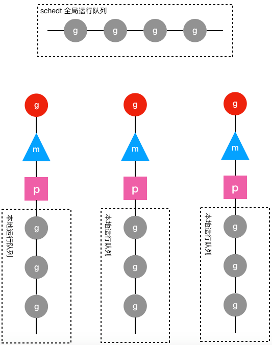

## goroutine协程

Go 语言最大的特色就是从语言层面支持并发。

Go 通过轻量级的 goroutines 和 channel 简便地处理并发问题。

goroutine 是 Go 语言实现的用户态线程，主要用来解决操作系统线程太“重”的问题。

#### 进程 

进程通信需要利用各种模式的 IPC（进程间通信），如信号量，消息队列，管道等。

#### 线程 

线程是可以在OS中执行的最小处理单元。

线程存在于某个进程中，进程可以包含多个线程。

线程之间共享内存。因此线程间通信比进程之间通信更加简单。

线程太“重”表现在一下两个方面：

  1，创建和切换太重：操作系统线程都需要进入内核，而进入内核所消耗的性能开销较大。

  2，内存使用太重：内核在创建操作系统线程时为避免极端情况下操作系统线程栈的溢出，默认为其分配一个较大的栈内存，通常会导致浪费，且栈内存空间一旦创建和初始化之后大小不能改变，某些特殊场景下系统线程栈还是有溢出的风险。

线程变慢原因：

线程自身有一个很大的堆（大于等于1MB）占用了大量内存。创建线程消耗太大。

线程需要重复存储许多寄存器，这会降低应用程序性能。

线程创建和消除是操作系统级别操作，这一操作较慢。

#### 协程

goroutine并不是轻量级线程，它依赖于线程运行。Goroutines是Golang中执行并发任务的方式。他们仅存在于Go运行时的虚拟空间中而不在于OS中，因此需要Go调度器来管理他们的生命周期。要记住对于所有操作系统看到的都只有一个请求并运行多个线程的单个用户级进程。goroutine由GoRuntimeScheduler管理。

为了使运行时的堆栈更小，新创建的goroutine只分配几kb的空间，如果不够，运行空间自动增长（或者缩小）内存来实现堆栈的管理，从而让大部分goroutine存在于适量的内存中。

#### 协程调度

MPG调度模型，两级线程模型

M，P，G，Schedt四个重要结构

https://segmentfault.com/a/1190000018150987

https://www.cnblogs.com/wdliu/p/9272220.html

#### 面试总结版本

Go语言通过轻量级的goroutine和channel来简便地处理并发问题，从语言层面支持并发。goroutine是Go语言实现的用户态线程，主要用来解决操作系统线程太“重”的问题。

因为操作系统线程是内核层去操作的，性能开销大。且内核在创建操作系统线程的时候给其分配的内存较大且固定，造成浪费，极端情况下还有溢出风险。

相比于操作系统线程，goroutine要轻量得多。goroutine是用户态线程，存在于Go运行时的虚拟空间中而不在于OS中，通过Go调度器来管理他们的生命周期。其创建和切换都在用户代码中完成而无须进入操作系统内核，性能开销小。且goroutine启动时默认栈大小只有2k，还可以动态扩大收缩，既避免浪费，又没有栈溢出风险。

所以Go程序中可以创建成千上万个goroutine并发执行任务而不用太担心性能和内存问题。

goroutine建立在操作系统线程基础之上，它与操作系统线程之间实现了一个多对多(M:N)的两级线程模型。这里M:N指M个goroutine运行在N个操作系统线程之上，内核负责对这N个操作系统线程进行调度，而这N个系统线程又负责对这M个goroutine进行调度和运行。

所谓的对goroutine的调度，指程序代码按照一定算法在适当的时候选出合适的goroutine并放到CPU上去运行的过程，负责对goroutine进行调度的程序代码称之为goroutine调度器。

MPG调度模型，两级线程模型

包含M，P，G，schedt四个重要结构

  G结构体。保存了goroutine的所有信息，该结构体的每个实例都代表了一个goroutine，调度器代码可以通过G对象来对goroutine进行调度。

  schedt结构体。保存调度器自身的状态信息和goroutine的全局运行队列。每个Go程序只有一个调度器，即schedt结构体只有一个实例对象，该实例对象在源代码中被定义成了一个共享的全局变量，这样每个工作线程都可以访问它以及它的goroutine运行队列，我们成这个队列为全局运行队列。

  P结构体。用于保存工作线程执行go代码时所必须的资源，goroutine的运行队列等。即除全局运行队列外，每个工作线程有一个私有的局部goroutine运行队列，工作线程优先使用自己的局部运行队列，必要时才去访问全局运行队列，减少锁冲突，提高性能，提高工作线程的并发性。局部运行队列被包含在P结构体的实例对象之中，每一个运行着go代码的工作线程都会与一个P结构体的实例对象关联在一起。

  M结构体。代表工作线程。每个工作线程都有唯一一个M结构体的实例对象与之对应，M对象记录着工作线程的栈起始位置、当前正在执行的goroutine以及是否空闲等信息，还通过指针维持着和P结构体的实例对象之间的绑定关系。通过M可以找到与之对应的工作线程正在运行的goroutine，还可以找到工作线程的局部运行队列等资源。

 

上图中圆形图案代表g结构体的实例对象，三角形代表m结构体的实例对象，正方形代表p结构体的实例对象，其中红色的g表示m对应的工作线程正在运行的goroutine，而灰色的g表示处于运行队列之中正在等待被调度起来运行的goroutine。

从上图可以看出，每个m都绑定了一个p，每个p都有一个私有的本地goroutine队列，m对应的线程从本地和全局goroutine队列中获取goroutine并运行之。

参考链接：

https://www.cnblogs.com/abozhang/p/10802319.html