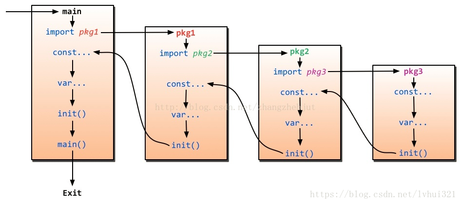

## 常见题

### defer

公众号 Golang来啦 《5年Gopher都不知道的defer细节》

1. 当函数返回时，执行 defer 语句。通常用来做资源回收处理。
2. 多个 defer 语句，按先进后出顺序执行。
3. defer 语句中的变量，在 defer 声明时就决定了。
4. `return xxx`这条语句并不是一个原子指令，经过编译之后得到三条指令：1，返回值=xxx；2，调用 defer 函数；3，空的 return。因此要注意执行 defer 语句时是否改变了返回值。

### 循环

```go
for k,v range slice {
    ...
}
```

for range 表达式中参与循环的是 slice 的副本。slice 可能是数组，切片或 map，应注意数组的副本是另一个数组，切片的副本其指向的底层数组还是原来那个数组。

v 是 for 循环内的局部变量，也是副本。

```go
for i := range slice {
    slice = append(slice, i)
}
```

上面代码中参与循环的是 slice 的副本，循环内改变 slice 长度不影响循环次数，因此不会出现死循环，能正常结束。

### init 函数及包初始化

init 函数用于程序执行前进行包的初始化，比如初始化包里的变量等。

* 一个包甚至一个源文件中可以出现多个 init 函数。
* 同一个包中多个 init 函数，执行顺序：
  * 如果多个 init 函数在不同的源文件中，则按源文件名以字典序从小到大排序，小的先被执行。准确来说，应是按提交给编译器的源文件名顺序为准，只是在提交编译器之前，go 命令行工具对源文件名按字典序排序了。
  * 同一包且同一源文件中的 init 函数，则按其出现在文件中的先后顺序依次初始化。
* 不同包 init 函数的执行顺序由包导入的依赖关系决定，从依赖的最顶层到最底层。
* init 函数在代码中不能被显示调用，也不能被引用。

包的初始化：

* 包的初始化顺序由包导入的依赖关系决定，从依赖的最顶层到最底层。
* 一个包被引用多次也只初始化一次。
* 不可出现循环导包。解决循环导包的常见思路：todo

同一 go 文件：

* 初始化顺序： (1) 导入的包； (2) 当前包中的变量常量； (3) 当前包的 init 函数； (4) main 函数。
* 包级别变量常量按其出现在文件中的先后顺序依次初始化。还有一大原则就是被引用的先初始化，比如某个变量需要依赖其他变量，则被依赖的变量先初始化。



### 值类型和引用类型变量

值类型：基本数据类型 int、float、bool、string 以及数组和 struct。值类型变量直接存储值，内存通常在栈中分配。

引用类型：指针、slice、map、chan、interface 等。引用类型变量存储的是一个地址，这个地址存储最终的值，内存通常在堆上分配，通过 GC 回收。

### 指针和引用

todo

相同：

* 都用来让一个变量提供对另一个变量的访问。Java 支持引用。

不同：

* 指针变量存储的是另一个变量的地址。引用变量指向另一个变量。
* 指针可以重新分配，而引用不能。

go 语言中引用类型变量打印出来是一个地址。

```go
// 测试

```

### interface 接口

**interface 的源码实现，内部结构**

todo

**静态类型、动态类型和动态值**

变量的类型在声明时指定、且不能改变，称为静态类型。接口的静态类型就是接口本身，接口没有静态值，它指向的是动态值。接口类型的变量存的是实现接口的类型的值，该值就是接口的动态值，该值的类型就是接口的动态类型。

当我们访问接口类型的时候，返回的是底层动态值的类型。

**nil 接口值**

当且仅当动态值和动态类型都为 nil 时，接口类型变量的值才为 nil。

**空接口 interface{}**

一个不包含任何方法的接口，称之为空接口，形如：interface{}。因为空接口不包含任何方法，所以任何类型都默认实现了空接口。函数参数为 interface{} 时可以接收任何类型的参数，包括指针类型（而不是使用 *interface{}）。

**类型断言**

类型断言可以用来获取接口的底层值。

```go
value := i.(Type)
```

其中 i 是接口类型变量，Type 是类型或接口。编译时会自动检测 i 的动态类型与 Type 是否一致。如果 Type 未实现接口 i，编译时报错；如果 i 的动态值不是 Type，则会报 panic 错误。

```go
value, ok := i.(Type)
```

可使用两个返回值语法，go 会自动检查上面提到的两种情况，我们只需要通过变量 ok 判断结果是否正确即可。如果动态类型不存在（i 的动态类型为 interface{}），则断言总是失败（第二个返回值为 false）。

**类型选择**

```go
switch i.(type) {
    case string：
    ...
}
```

其中 i 是接口类型变量，type 是关键字，只有接口类型变量才可以使用类型选择，将接口的具体类型与各种 case 语句中的类型进行匹配比较。

**接口嵌套**

go 语言中，接口不能去实现或集成别的接口，但是可以通过嵌套接口创建新接口。

```go
type Math interface {
    Shape
    Object
}
type Shape interface {
    Area() float32
}
type Object interface {
    Perimeter() float32
}
```

通过嵌套接口 Shape 和 Object，创建了新接口 Math。任何类型如果实现了接口 Shape 和 Object 定义的方法，则说类型也实现了接口 Math。

### 方法与函数

#### 函数

> func methodName(...Type) Type {...}

函数的入参支持可变参数列表，但必须是入参的最后一个。

函数参数只有值传递，没有引用传递，即全部需要重新拷贝变量。可通过传递指针或者引用类型实现引用传递的效果。

函数也是一种类型，函数不能重载（函数名相同，入参等不同）。

**内建函数**

* new 和 make

new(T) 和 make(T, args) 是 Go 语言内建函数，用来分配内存，但适用的类型不一样。new 为 T 类型的新值分配已置零的内存空间，并返回地址 *T，适用于值类型，如 int、数组、结构体等。make 得到的是初始化之后的 T 的引用，用来分配引用类型，只适用于 slice、map 和 channel。

通过 make 创建的切片可以 copy，其他方式不行。

通过 make 创建的 map 是空 map，通过字面量形式创建的 map 是 nil，切片同理。

使用 make 创建 map 变量时可以指定第二个参数，不过会被忽略。

* cap 和 len

cap 获取容量，len 获取长度。

cap 适用于数组、数组指针、slice 和 channel。不适用于 map。

可以用 len 返回 map 的元素个数。

* close

主要用来关闭 channel。

* append

用来追加元素到数组、slice 中。

* panic 和 recover

用来做错误处理。

todo：panic，recover，defer 的关系。

当协程遇到 panic 时，会遍历该协程的 defer 并依次执行（执行顺序是先进后出）。如果在 defer 执行的过程遇到 recover 则停止 panic，返回 recover 继续向下执行，如果没有遇到 recover，遍历完 defer，然后向 stderr 抛出 panic 信息。如果执行第一个 defer 出现异常，顺序执行下一个 defer？

#### 方法

> func (receiver Type) methodName(...Type) Type {...} 

方法定义和函数类似，区别在于方法定义时，在 func 和方法名之间会增加一个额外的参数。(receiver Type) 是额外增加的参数，receiver 称为接收者，Type 可以是任意合法的类型。可以说，方法 methodName 属于类型 Type。

必须保证类型和其方法定义在同一个包里。如果做不到，可以创建类型别名。

每个方法声明的时候，编译器会各自声明相对应的隐式函数。

**值接收者方法和指针接收者方法**

方法的接收者是副本。值接收者方法和指针接收者方法最大区别在于，在方法中修改指针接收者的值会影响到调用者的值，而修改值接收者的值不会。一个是值的副本，一个是指针的副本，指针的副本指向的还是原来的值。

方法集：一组关联到自定义类型的值或指针的方法。一个自定义类型 T 的方法集仅包括它的值方法，该类型的指针类型 *T 的方法集包括它的值方法和指针方法。

调用指针接收者方法也可以写成值调用`a.A()`形式，编译器会自动帮我们转成指针调用`(&a).A()`，以满足接收者的要求。调用值接收者方法也可以写成指针调用，因为值接收者方法属于该类型的指针类型 *T 的方法集。

因此，值接收者的方法可以使用值或者指针调用。而对于指针接收者的方法，用一个指针或者一个可取得地址的值来调用都是合法的。

但是，假设有类似函数返回的空结构体 T{} 不可寻址的情况，不可寻址的结构体不能调用该结构体指针接收者的方法。要保证可寻址的结构体才可以调用该结构体指针接收者的方法。

根据场景考虑使用值接收者还是指针接收者方法。如在方法中发生的变化对调用者可见或值接收者变量拷贝成本高，应考虑使用指针接收者方法。其他情况建议使用值接收者方法。

注意：不能用多级指针调用方法。

#### 方法与函数的比较

方法属于某一类型。

为什么有了函数还需要方法？

1. Go 不是纯粹的面向对象的语言且不支持类，通过方法可以实现和类相似的功能，又不会像类那样显得很“重”；
2. 同名的方法可以定义在不同的类型上，但是函数名不允许相同。

### ... 的使用

1. 放在函数入参最后作为可变参数。

2. 切片作为可变参数函数的参数。

3. 数组定义

   ```go
   var arr = [...]int{1,2,3,4,5}
   ```

   编译器会自动确定数组长度。

4. append 函数

   ```go
   var a = []int{1,2,3}
   var b = []int{4,5,6}
   a = append(a, b...)
   ```

### select 使用

* select 机制用来处理异步 IO 问题，每个 case 语句里必须是一个 IO 操作。
* 有可执行的 case 则执行；多个可执行则随机选择一个可用通道做收发操作；所有 case 都阻塞且没有 default，则阻塞；所有 case 都阻塞且有 default，执行 default。select{} （空 select）会导致阻塞。
* case 分支中如果 channel 为 nil，该分支会被忽略。
* case <-time.After(time.Second): 超时执行。

### context 使用

定义，原理：todo

使用场景：超时控制，保存全局信息。

使用方法

### 声明和赋值问题

* 单变量声明

  如`x := 1`，用于声明之前未声明过的变量 x，并赋值为 1。

* 多变量声明

  如`x, y := 1, 2`，左边的变量有一个是未声明过的就可以。如果变量 x 与同名已定义的变量 x 不在同一个作用域中，那么 go 会重新定义这个变量。

* 结构体字段不能声明

  `data.result, err := work()`出错

  := 操作符不能用于结构体字段声明，应修改为赋值的方式

  ```go
  var err error
  data.result, err = work()
  ```

* 被赋值变量可取址

  对于类似`x = y`的赋值操作，必须知道 x 的地址，才能够将 y 的值赋给 x。map 的 value 不可寻址，所以不能赋值。

* 多重赋值

  ````go
  var i, j int
  s := make([]string, 0)
  j = 1
  i，s[j-1] = 1，"a" 
  ````

  最后一行分为两个步骤执行，有先后顺序：

  1. 计算等号左边的索引表达式和取址表达式，接着计算等号右边的表达式
  2. 赋值

  所以上面赋值实际先计算索引`j-1`的值，然后执行赋值操作`i, s[0] = 1, "s"`

* 字面量初始化数组、slice 和 map 时，最好是在每个元素后面加上逗号，即使是声明在一行或者多行都不会出错。

  ```go
  x := []int{1,2,}
  y := []int{
      1,
      2,
  }
  ```

### 常量

* 常量无法使用&取址。
* 常量声明组中如不指定类型和初始化值，则与上一行非空常量相同。
* iota
  * https://www.cnblogs.com/zsy/p/5370052.html
  * iota 是 go 语言中的常数计数器，只能在常量的表达式中使用。iota 在 const 关键字出现时将被重置为 0，const 中每新增一行常量声明将使 iota 计数一次。

### string、byte 和 rune

byte 是 uint8 的别名，rune 是 int32 的别名，别名之间可直接转换。

**string**

* go 语言中字符串是只读的字节切片。
* string 类型变量的空值为 "" 。不能赋值为 nil，也不能判断是否等于 nil。

**将 string 转成 rune 切片**

```go
s := "hello"
r := []rune(s) 
```

### 比较

* 不同类型不能进行比较。
* map、slice 和 function 属于不可比较类型，只能判断是否为 nil。
* 数组长度是数组类型的一部分，不同长度的数组为不同类型，不能进行比较。
* 结构体比较
  * 结构体只能比较是否相等。
  * 结构体可比较的前提是所有成员变量的类型均可比较。
  * 相同类型的结构体才能进行比较。结构体是否相同不但与属性类型有关，还与属性顺序有关。
  * 如果结构体的所有成员都可以比较，可通过 == 或 != 比较是否相等，比较时逐项进行比较，如果每一项都相等，则两个结构体相等。

### nil 值问题

nil 只能赋值给指针、channel、function、interface、map 或 slice 类型的变量。

`var x = nil` 会导致编译错误，因为 nil 为上述类型的零值，如果不指定变量类型，编译器猜不出来变量的具体类型，导致编译错误。

### 代码编译合规规则

* 函数中声明的变量必须要使用，但可以有未使用的全局变量。函数的参数未使用也是可以的。
* 常量声明但未使用是能通过编译的，常量编译后是一个简单值的标识符。
* 导入的包如果未使用，代码不能通过编译。如果需要导入包又不想使用（只想执行包的初始化），可以用 `_ "fmt"` 使通过编译。
* 只有 `i++` 和`i--` 形式的自增自减，且只能作为独立语句，不能作为表达式。

### 面向对象编程

Go 语言中的“继承”和多态。Go 语言没有继承，但是可以通过组合（嵌入）的方式实现代码的复用。

**嵌入类型**

将已有的类型直接声明在新的结构类型里。通过嵌入，内部类型的属性、方法可以为外部类型所用。此外，外部类型还可以定义自己的属性和方法，甚至和内部类型相同的方法，这样内部类型的方法就会被“屏蔽”。

如果内部类型实现接口 A，可以认为外部类型也实现了接口 A。

假设外部结构体类型是 S，内部类型是 T，调用内部类型的方法按如下规则：

* T 嵌入 S，外部类型 S 可以通过值类型或指针类型调用内部类型 T 的值接收者方法；
* T 嵌入 S，外部类型 S 只能通过指针类型调用内部类型 T 的指针接收者方法；
* *T 嵌入 S，外部类型 S 可以通过值类型和指针类型调用内部类型 T 的值接收者方法和指针接收者方法；

总结成一句话：不管是 T 嵌入 S，还是 *T 嵌入 S，外部类型 S 唯独通过值类型不能调用内部类型 T 的指针方法外，其他情况下内部类型 T 的方法都可以被外部类型 S 访问。

### go build, go install 和 go get

* go build : 编译出可执行文件
* go install : go build + 把编译后的可执行文件放到 GOPATH/bin 目录下
* go get : git clone + go install

### 输入输出问题

- 如果某个类型实现了 String() 方法，当格式化输出的时候会自动使用 String() 方法。

- 格式化输出

  ```go
  i := -5
  fmt.printf("%+d", i)
  ```

  其中 %d 表示输出十进制数字，+ 表示输出数值的符号。

### 闭包

todo 


go 语言中文网公众号 面试题 day61
19 锁失效，应该 data 指针作为 test() 的方法接收者


