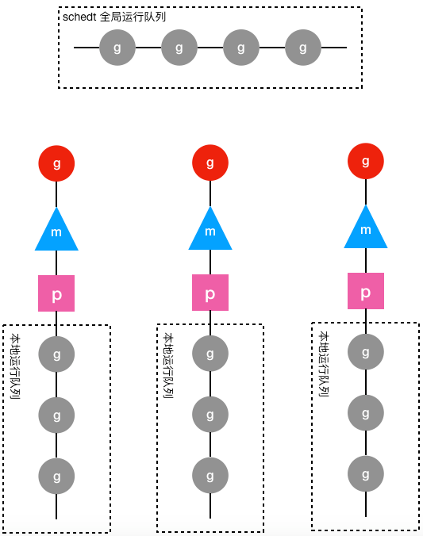

# go并发编程之 goroutine

## 并发编程

### 并行与并发

并行是在某一时间点能执行多个任务，并发是在某一时间段内可以同时处理多个任务。并行需要多线程的支持，而单线程时可以多个任务以间隔执行方式实现并发。

通常说程序是并发设计的，就是说它允许多个任务同时执行。而实际是并发执行还是并行执行，需要看是单核还是多核环境。

### 并发相关的重要概念

#### 数据竞争

在非线程安全的情况下，多个线程对同一个地址空间进行读写操作，造成了预料之外的结果。

#### 内存访问同步

代码中需要控制同时只有一个线程访问的区域称为临界区。临界区的访问，必定要使其逻辑上进行顺序化和原子化，确保访问一致，这绕不开锁这个概念。

Go 语言中一般使用 sync 包里的 mutex 等组件来完成同步访问控制。锁一般会带来比较大的性能开销，因此一般要考虑加锁的区域是否会频繁进入、锁的粒度如何控制等问题。

#### 原子性

原子性指一个操作是不可中断的特性，要么全部执行成功要么全部执行失败。原子性可以让我们放心地构造并发安全的程序。

有些代码，在程序里看起来是原子的，如最简单的 i++，但在机器层面看来，这条语句通常需要几条指令来完成（Load，Incr，Store），也就不是原子性的。

#### 死锁

死锁是指两个或两个以上的进程（或线程）在执行过程中，因争夺资源或彼此通信而造成的一种互相等待的现象，若无外力作用，它们都将无法推进下去。此时称系统处于死锁状态或系统产生了死锁，这些永远在互相等待的进程称为死锁进程。

#### 活锁

活锁是另一种形式的活跃性问题，该问题尽管不会阻塞线程，但也不能继续执行，因为线程将不断重复同样的操作，而且总会失败。

想象一下，你走在一条小路上，一个人迎面走来。你往左边走，想避开他；他做了相反的事情，他往右边走，结果两个都过不了。之后，两个人又都想从原来自己相反的方向走，还是同样的结果。这就是活锁，看起来都像在工作，但工作进度就是无法前进。

#### 饥饿

饥饿是指一个可运行的进程尽管能继续执行，但被调度器无限期地忽视，而不能被调度执行的情况。通常是有一个或多个贪婪的并发进程或线程，长时间占据资源不释放，导致其他并发进程或线程无法获取资源进行下一步的工作。

与死锁不同的是，饥饿锁在一段时间内，优先级低的线程最终还是会执行的，比如高优先级的线程执行完之后释放了资源。活锁与饥饿是无关的，因为在活锁中，所有并发进程都是相同的，并且没有完成工作。

## goroutine

### 进程、线程与协程

#### 进程

进程就是运行起来的程序，是系统进行资源分配的最小单位。即操作系统会以进程为单位，分配系统资源（CPU时间片、内存等资源）。

由于每个进程拥有独立的进程地址空间，一个进程崩溃，其他进程不受影响。

进程通信需要利用各种模式的 IPC（进程间通信），如信号量，消息队列，管道，套接字等。

#### 线程

也被称为 LWP（light weight process）轻量级进程。线程是操作系统调度（CPU 调度）执行的最小单元。

线程存在于某个进程中。一个线程只能属于一个进程，一个进程有至少一个线程。

线程不拥有系统资源，但可以访问隶属于进程的资源。

同一进程的所有线程共享该进程的所有资源，包括内存，因此线程间通信比进程之间通信更加简单。

#### 协程

coroutine，也叫轻量级线程。与传统的系统级线程和进程相比，协程的优势在于轻量，可以轻松创建上万个而不会导致系统资源衰歇。

一个线程中可以有任意多个协程，但同一时间点只能有一个协程在运行，多个协程分享该线程分配到的计算机资源。

进程、线程都是由内核进行抢占式调度，有 CPU 时间片的概念，而协程由用户程序调度。

**线程与协程比较**

相比协程，线程太重表现在两个方面：

1. 创建和切换太重：操作系统线程需要进入内核，而进入内核所消耗的性能开销较大。
2. 内存使用太重：内核在创建操作系统线程时为避免极端情况下操作系统线程栈的溢出，默认为其分配一个较大的栈内存，通常会导致浪费，且栈内存空间一旦创建和初始化之后大小不能改变，某些特殊场景下系统线程栈还是有溢出的风险。

线程慢原因：

1. 线程创建和消除是操作系统级别操作，这一过程速度慢，消耗大。
2. 线程自身有一个很大的堆（大于等于1MB）占用了大量内存。
3. 线程需要重复存储许多寄存器，这会降低应用程序性能。

### goroutine

Go 语言从语言层面支持并发，通过轻量的 goroutines 和 channel 可以简便地处理并发问题。

goroutine 是 Go 语言实现的用户态线程（协程），依赖于线程运行。因为对于所有操作系统，看到的都只有一个请求并运行多个线程的单个用户级进程，线程才是操作系统调度执行的最小单元。

goroutine 是 Go 中执行并发任务的方式，Go 应用程序通常能并发地运行成千上万的协程。他们由 Go 运行时管理（Go 运行时负责给协程分配和回收资源），仅存在于 Go 运行时的虚拟空间中而不在 OS 中，由调度器 GoRuntimeScheduler 来管理他们的生命周期。

goroutine 解决了操作系统线程太“重”的问题。为了使运行时的堆栈更小，新创建的 goroutine 只分配几 kb 的空间，如果不够，运行空间自动增长（或者缩小）内存来实现堆栈的管理，从而让大部分 goroutine 存在于适量的内存中。

#### 创建 goroutine

创建 goroutine 非常简单，只要在方法或函数调用之前加关键字 go 即可。

```go
func printHello() {
    fmt.Println("hello world goroutine")
}

func main() {
    go printHello()     // 创建协程
    go func() {			// 创建匿名协程
3        fmt.Println("hello world goroutine 2")
4    }()
    fmt.Println("main goroutine")
}
```

上面代码，使用 go 关键字创建了两个协程，因此现在包括主协程一共有三个协程。多个协程并发执行。主协程执行完毕，程序便退出，其他协程随即也退出。

#### 协程调度

MPG 调度模型，两级线程模型

M，P，G，Schedt 四个重要结构

https://segmentfault.com/a/1190000018150987

https://www.cnblogs.com/wdliu/p/9272220.html

#### 其他面试题

2. goroutin 的调度，什么是抢占式goroutine调用；
3. 僵尸进程和孤儿进程；
5. 怎样停止一个 goroutine，怎么实现协程完美退出

#### 面试总结版本

Go 语言通过轻量级的 goroutine 和 channel 来简便地处理并发问题，从语言层面支持并发。goroutine 是 Go 语言实现的用户态线程，主要用来解决操作系统线程太“重”的问题。

因为操作系统线程是内核层去操作的，性能开销大。且内核在创建操作系统线程的时候给其分配的内存较大且固定，造成浪费，极端情况下还有溢出风险。

相比于操作系统线程，goroutine 要轻量得多。goroutine 是用户态线程，存在于 Go 运行时的虚拟空间中而不在于 OS 中，通过 Go 调度器来管理他们的生命周期。其创建和切换都在用户代码中完成而无须进入操作系统内核，性能开销小。且 goroutine 启动时默认栈大小只有 2 kb，还可以动态扩大收缩，既避免浪费，又没有栈溢出风险。

所以 Go 程序中可以创建成千上万个 goroutine 并发执行任务而不用太担心性能和内存问题。

goroutine 建立在操作系统线程基础之上，它与操作系统线程之间实现了一个多对多 (M:N) 的两级线程模型。这里 M:N 指 M 个 goroutine 运行在 N 个操作系统线程之上，内核负责对这 N 个操作系统线程进行调度，而这 N 个系统线程又负责对这 M 个 goroutine 进行调度和运行。

所谓的对 goroutine 的调度，指程序代码按照一定算法在适当的时候选出合适的 goroutine 并放到 CPU 上去运行的过程，负责对 goroutine 进行调度的程序代码称之为 goroutine 调度器。

GMP 调度模型，两级线程模型

包含 M，P，G，schedt 四个重要结构

* G 结构体。保存了 goroutine 的所有信息，该结构体的每个实例都代表了一个 goroutine，调度器代码可以通过 G 对象来对 goroutine 进行调度。

* schedt 结构体。保存调度器自身的状态信息和 goroutine 的全局运行队列。每个 Go 程序只有一个调度器，即 schedt 结构体只有一个实例对象，该实例对象在源代码中被定义成了一个共享的全局变量，这样每个工作线程都可以访问它以及它的 goroutine 运行队列，我们成这个队列为全局运行队列。

* P 结构体。用于保存工作线程执行go代码时所必须的资源，goroutine 的运行队列等。即除全局运行队列外，每个工作线程有一个私有的局部 goroutine 运行队列，工作线程优先使用自己的局部运行队列，必要时才去访问全局运行队列，减少锁冲突，提高性能，提高工作线程的并发性。局部运行队列被包含在 P 结构体的实例对象之中，每一个运行着 go 代码的工作线程都会与一个 P 结构体的实例对象关联在一起。

* M 结构体。代表工作线程。每个工作线程都有唯一一个 M 结构体的实例对象与之对应，M 对象记录着工作线程的栈起始位置、当前正在执行的 goroutine 以及是否空闲等信息，还通过指针维持着和 P 结构体的实例对象之间的绑定关系。通过 M 可以找到与之对应的工作线程正在运行的 goroutine，还可以找到工作线程的局部运行队列等资源。

 

上图中圆形图案代表 g 结构体的实例对象，三角形代表 m 结构体的实例对象，正方形代表 p 结构体的实例对象，其中红色的 g 表示 m 对应的工作线程正在运行的 goroutine，而灰色的 g 表示处于运行队列之中正在等待被调度起来运行的 goroutine。

从上图可以看出，每个 m 都绑定了一个 p，每个 p 都有一个私有的本地 goroutine 队列，m 对应的线程从本地和全局 goroutine 队列中获取 goroutine 并运行之。

参考链接：

https://www.cnblogs.com/abozhang/p/10802319.html


