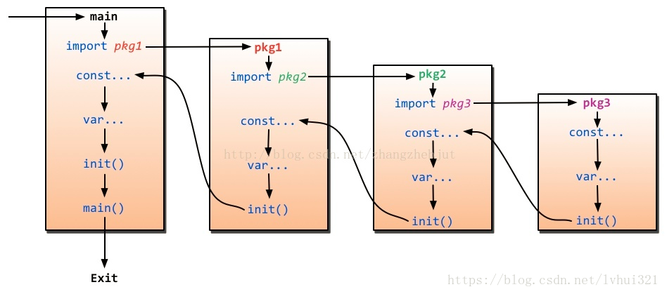

## go语言初始化

在一个 go 程序中通常包含：包、常量、变量、init()、main()等元素，如果同时存在多个包，包之间存在依赖关系，每个包中存在多个 init 函数，每个文件中存在多个 init 函数，那么他们之间的执行顺序是什么样的？本文将对它们之间的执行顺序做尽可能详尽的说明。

**包引用**

1. 在 main 包中的 go 文件默认总是会被执行，其他的包只有被 main 包 import 才会执行，按照 import 的先后顺序执行，main 包总是被最后一个初始化，因为它总是依赖别的包

2. 包 A 导入包 B , 包 B 又导入包 C , 则包的初始化顺序为： C -> B -> A

3. 导入包，必须避免死循环，如 A 引 B , B 引 C, C 引 A

4. 一个包被其它多个包导入，如A -> B ->C 和 H -> I -> C , C被其它包引了2次， 但是注意包C只被初始化一次

**go 程序的初始化顺序见下图**

**同一包下**

如果当前包有多个 init 在不同的源文件中， 则按源文件名以字典序从小到大排序，小的先被执行到， 同一包且同一源文件中的init,则按其出现在文件中的先后顺序依次初始化； 当前包的 package level 变量常量也遵循这个规则； 其实准确来说，应是按提交给编译器的源文件名顺序为准，只是在提交编译器之前，go 命令行工具对源文件名按字典序排序了

**在一个go文件中**

初始化顺序规则： (1) 导入的包 (2) 当前包中的变量常量 (3) 当前包的 init (4) main 函数

还有一大原则就是被引用的先初始化，比如某个变量需要依赖其他变量，则被依赖的变量先初始化

**init 和 main 函数**

init 和 main 函数是go语言中的保留函数，他们的区别如下

相同点：1，两个函数在定义时不能有任何的参数和返回值  2，该函数只能由 go 程序调用，不能被显示调用，不能被引用

不同点：1，init 函数可以应用于任何包中，且可以重复定义  2，main 函数只能用于main包中，且只能定义一个

**参考**

https://blog.csdn.net/htyu_0203_39/article/details/50948193

https://blog.csdn.net/claram/article/details/77745665